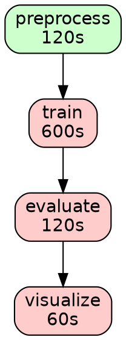

# DAG Planner

The DAG planner converts a set of declared reproduction steps into an ordered
execution plan.  It performs dependency resolution, cycle detection, parallel
group identification, and critical path analysis -- all without executing any
code.

## How it works

Given a `reproducibility.yml` with steps that declare `needs` dependencies, the
planner builds a directed acyclic graph (DAG) and produces an execution plan.

### 1. Node creation

Each step becomes a DAG node with its command, dependencies, outputs, and
timeout.

### 2. Edge creation

For every `needs` entry, a directed edge is created from the dependency to the
dependent step.  Missing dependencies (references to non-existent steps) are
recorded as warnings.

### 3. Cycle detection

Kahn's algorithm is used to detect cycles.  Nodes involved in cycles are
marked as blocked and excluded from the topological order.

```yaml
# This creates a cycle: step-a -> step-b -> step-c -> step-a
steps:
  step-a:
    command: python scripts/a.py
    needs: [step-c]
  step-b:
    command: python scripts/b.py
    needs: [step-a]
  step-c:
    command: python scripts/c.py
    needs: [step-b]
```

The planner reports:

```
Cycle(s) detected involving 3 step(s): step-a, step-b, step-c
```

### 4. Topological sort

Steps without cycles are sorted in topological order using Kahn's algorithm
with a min-heap for deterministic (lexicographic) tie-breaking.

For a pipeline like:

```
preprocess --> train --> evaluate --> visualize
```

The topological order is: `preprocess, train, evaluate, visualize`.

### 5. Parallel group identification

Steps at the same depth (longest path from any root) form a parallel group.
These steps have all their dependencies satisfied and can run concurrently.

```
preprocess
    |
    +---> feature-engineering --+
    |                           |
    +---> augment --------------> train
```

- Group 0: `preprocess`
- Group 1: `feature-engineering`, `augment` (parallel)
- Group 2: `train`

### 6. Critical path analysis

The critical path is the longest weighted path through the DAG, where each
step's weight is its timeout.  This represents the minimum total execution
time if parallelism is maximized.

```
preprocess (30s) --> train (600s) --> evaluate (120s) --> visualize (60s)
Critical path duration: 810s
```

### 7. Execution plan

The final plan lists steps in topological order with:

- **Status**: `ready`, `blocked`, or `skipped`
- **Parallel group**: index of the parallel group
- **Depth**: longest path from any root
- **Timeout**: declared timeout in seconds
- **Dependencies**: list of step IDs this step depends on

Steps are blocked if they are in a cycle or have missing dependencies.
Steps that depend on blocked steps are skipped.

## CLI usage

```bash
# Generate execution plan (markdown)
oss-paper-ci dsl plan reproducibility.yml --format markdown

# Generate execution plan (JSON)
oss-paper-ci dsl plan reproducibility.yml --format json --output plan.json

# Generate execution plan (HTML)
oss-paper-ci dsl plan reproducibility.yml --format html --output plan.html

# Output DAG in DOT format for Graphviz
oss-paper-ci dsl graph reproducibility.yml --output dag.dot

# Render DOT to PNG (requires Graphviz)
dot -Tpng dag.dot -o dag.png

# Human-readable DAG explanation
oss-paper-ci dsl explain reproducibility.yml --format markdown
```

## Plan output

The plan includes:

- **Executable**: whether the plan can be executed (no errors, no cycles, no
  safety blocks)
- **Steps**: ordered list with status, parallel group, and dependencies
- **DAG summary**: topological order, critical path, parallel groups, cycles,
  missing dependencies
- **Validation**: schema validation findings
- **Safety**: safety check results
- **Warnings**: any issues found during planning

Example markdown output:

```markdown
# Execution Plan

**Executable:** Yes
**Dry run:** True
**Total timeout:** 810s
**Parallel groups:** 4
**Steps:** 4

- Ready: 4
- Blocked: 0
- Skipped: 0

## DAG Summary

- **Topological order:** `preprocess -> train -> evaluate -> visualize`
- **Critical path:** `preprocess -> train -> evaluate -> visualize`
- **Critical path duration:** 810s

## Steps

| # | Step ID     | Status | Parallel Group | Timeout | Dependencies |
|---|-------------|--------|----------------|---------|--------------|
| 1 | preprocess  | ready  | 0              | 120s    | -            |
| 2 | train       | ready  | 1              | 600s    | `preprocess` |
| 3 | evaluate    | ready  | 2              | 120s    | `train`      |
| 4 | visualize   | ready  | 3              | 60s     | `evaluate`   |
```

## DOT output

The `graph` command outputs a Graphviz DOT file:



Nodes on the critical path are highlighted in red.  Nodes in parallel groups
are green.  Nodes in cycles are gray.

## Behavior notes

- The planner defaults to dry-run mode.  It describes what *would* happen
  without running anything.
- The plan never executes code, installs packages, or accesses the network.
- If the DAG has cycles, those steps are marked as blocked and reported in
  warnings.
- If a step depends on a non-existent step, it is reported as a missing
  dependency warning.
- Safety-blocked commands (e.g., `sudo`, `rm -rf /`) cause the plan to report
  those steps as blocked.

## Related documentation

- [Reproducibility DSL Overview](reproducibility-dsl.md)
- [Reproducibility Schema v1](reproducibility-schema-v1.md)
- [DSL Safety](dsl-safety.md)
- [DSL Examples](dsl-examples.md)
